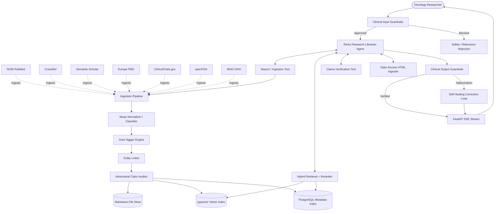

# <p align="center"><br>MEDICA</p>
<p align="center">
  <strong>Autonomous Oncology Intelligence Operating System</strong>
</p>

<p align="center">
  
  
  
  
  
  
</p>

---

**MEDICA** is a production-grade, agentic oncology research operating system. It continuously ingests, verifies, indexes, links, and maintains clinical and scientific cancer research knowledge from trusted, canonical databases — including NCBI PubMed, CrossRef, Semantic Scholar, Europe PMC, ClinicalTrials.gov, openFDA, and WHO.

Going far beyond simple RAG or shallow chatbots, MEDICA acts as a **structured scientific memory system** and a **guarded oncology librarian** equipped with adversarial claim verification, clinical evidence grading, real-time Open Access paper ingestion, and interactive citation graph cross-linking.

---

## 🚀 Core Architectural Engine



---

## ✨ What's New in v2.0

| Feature | Description |
|---|---|
| 🔌 **Swappable LLM Factory** | Unified `LLMFactory` supporting Gemini, OpenAI, Anthropic & Groq from a single config with automatic failover |
| 🌐 **4 New Data Sources** | Europe PMC, ClinicalTrials.gov API v2, openFDA drug labels, WHO Global Health Observatory |
| 📄 **Open Access Chat Ingestion** | Paste any DOI or OA URL into chat — full-text HTML is fetched, parsed, embedded, and indexed live |
| 🛡️ **Clinical Safety Guardrails** | Input relevance filter, prompt injection defense, output p-value self-healing loop |
| 📊 **Advanced Oncology Reranker** | Biomarker matching boost, log citation density, trial cohort size scoring, strict retraction penalties |

---

## 🏗️ Core Pipeline Components

### 1. Ingestion Pipeline & Normalizer
* Continuously ingests clinical trial papers matching oncology terms from **7 data sources**.
* Classifies literature by evidence grade: RCTs, Meta-Analyses, Systematic Reviews, Preclinical Studies.
* Auto-tags 22+ cancer types, 25+ oncological drugs, 20+ biomarkers & mutations.

### 2. Clinical Safety Guardrails
* **Input**: Validates oncology relevance; blocks prompt injection attempts.
* **Output**: Extracts p-values, hazard ratios, OS/PFS from responses and cross-checks against cited source abstracts. Triggers LLM self-healing if any mismatch is detected.

### 3. Adversarial Claim Verification Agent
* Dual LLM skeptic + rule-based scorer audits every clinical claim.
* Validates statistics, identifies biases, cross-references sample sizes, assigns evidence levels.

### 4. Open Access Paper Ingestion
* Paste any **DOI** or **Open Access URL** directly into the chat copilot.
* MEDICA fetches full-text HTML, strips boilerplate, extracts structured clinical metadata and claims via the LLM Factory, generates vector embeddings, and updates the local knowledge base — streamed live in the UI.

### 5. Markdown-First Canonical Memory Store
* Papers stored under `knowledge/cancers/<type>/papers/` as YAML-frontmatter structured markdown.
* Version-controlled, auditable, and editable.

### 6. Advanced Hybrid Retrieval & Reranker Engine
Multi-stage retriever combining:
* **pgvector Semantic Search (35%)** — dense vector cosine similarity.
* **PostgreSQL Full-Text Search (30%)** — exact clinical vocabulary.
* **Categorical Tag Match** — explicit drug/biomarker markers.

Advanced Evidence Reranker applies:
* Molecular **biomarker alignment boost** (+0.15 for EGFR/KRAS/BRCA/ALK/HER2/etc. matches)
* **Logarithmic citation density** scaling
* **Trial cohort size** boost (log scale, max at n=1000)
* Strict penalties for retracted (×0.02) and disputed (×0.40) works

### 7. Swappable LLM Factory
Unified `core/llm.py` interface implemented for:
* **Google Gemini** (default)  •  **OpenAI GPT-4o**  •  **Anthropic Claude**  •  **Groq Llama-3**

Swap providers from `.env` with zero code changes. Automatic failover to a secondary provider on rate-limit or error.

### 8. Autonomous ReAct Agent Loop
Multi-step reasoning loop that executes tools to search, read, retrieve, and cross-reference research. Streams thoughts, tool calls, and observations live via **Server-Sent Events (SSE)**.

---

## 🎨 Premium Frontend Portal

Built with **Next.js (App Router), TypeScript, and Vanilla CSS**:

* 💬 **Chat Copilot** — Streams the ReAct chain (`Thought → Action → Observation`). Auto-detects and ingests pasted DOIs/URLs.
* 🕸️ **Interactive Force Graph** — Physics-based network mapping cancer types, drugs, and biomarkers.
* 📂 **Knowledge File Explorer** — In-browser markdown file manager.
* 📄 **Split-Screen Paper Viewer** — Abstracts, evidence tags, adversarial critiques, and links to contradictory trials.
* 📈 **Evidence Auditor** — Clinical caveats dashboard (sample sizes, funding conflicts).
* ⚙️ **Operator Console** — Trigger ingestion jobs and monitor background task schedules.

---

## 📁 Repository Structure

```
MEDICA/
├── backend/
│   ├── agents/               # ReAct Research Librarian & Agent Tools
│   ├── api/                  # FastAPI App, SSE Streams, Admin, Search Router
│   ├── core/                 # Config, LLM Factory, Guardrails, Logging
│   ├── indexing/             # Keyword, Vector & Metadata Indexers
│   ├── ingestion/            # PubMed · CrossRef · Semantic Scholar · Europe PMC
│   │                         # ClinicalTrials.gov · openFDA · WHO adapters
│   ├── knowledge/            # Database Seeders, Canonical Markdown Store
│   ├── processing/           # Entity Linker, Normalizer, Tagger, OA Ingester
│   ├── retrieval/            # Hybrid Retrieval Engine & Advanced Evidence Reranker
│   ├── scheduler/            # Background Ingestion & Verification Jobs
│   ├── shared/               # PostgreSQL Schemas, Models & Utils
│   ├── verification/         # Adversarial Claim Auditor & Skeptic Evaluators
│   └── requirements.txt
│
├── frontend/                 # Next.js React Frontend Portal
│   ├── app/                  # App Router (Chat, Explorer, Graph, Admin)
│   └── components/
│
├── knowledge/                # Canonical Local Markdown Memory Store
├── scripts/                  # Database scaffolding SQL
├── tests/                    # Backend Verification Suite
├── Makefile
├── .env.example
└── README.md
```

---

## 🛠️ Developer Setup

### 1. Prerequisites
* Docker & Docker Compose  •  Node.js v18+  •  Python 3.10+

### 2. Configure Environment Variables
```bash
cp .env.example .env
```

| Variable | Description | Default |
|---|---|---|
| `LLM_PROVIDER` | Active provider (`gemini` / `openai` / `anthropic` / `groq`) | `gemini` |
| `GEMINI_API_KEY` | Google Gemini key | — |
| `OPENAI_API_KEY` | OpenAI key | — |
| `ANTHROPIC_API_KEY` | Anthropic key | — |
| `GROQ_API_KEY` | Groq key | — |
| `FALLBACK_LLM_PROVIDER` | Provider to use if primary fails | `gemini` |
| `NCBI_API_KEY` | NCBI key (higher rate limits) | — |
| `NCBI_EMAIL` | Required by NCBI E-utilities | `medica@research.local` |

> If no LLM key is set, MEDICA falls back to zero-key local hybrid retrieval mode automatically.

### 3. Docker Compose (recommended)
```bash
docker-compose up --build -d
```
* PostgreSQL + pgvector → `localhost:5432`
* FastAPI backend → `localhost:8000` (Swagger at `/docs`)
* Next.js frontend → `localhost:3000`

### 4. Local Development

```bash
# Backend
cd backend
python -m venv venv
source venv/bin/activate   # Windows: .\venv\Scripts\activate
pip install -r requirements.txt
python migrate_v2.py       # Upgrade database schema to v2.0
uvicorn api.main:app --reload --port 8000

# Frontend
cd frontend
npm install
npm run dev
```

---

## 📈 Makefile Commands

| Command | Action |
|---|---|
| `make up` | Start all containers |
| `make down` | Stop all containers |
| `make backend-logs` | Stream backend logs |
| `make db-shell` | Open PostgreSQL shell |
| `make test` | Run verification suite |

---

## 🔬 Example Queries

* *"Verify osimertinib combination trials in EGFR NSCLC"*
* *"Review pembrolizumab in mismatch repair-deficient colorectal cancer"*
* *"What clinical evidence supports CAR-T infusion in glioblastoma?"*
* *Paste a DOI like* `10.1056/NEJMoa2301638` *to ingest a paper live into the session*
