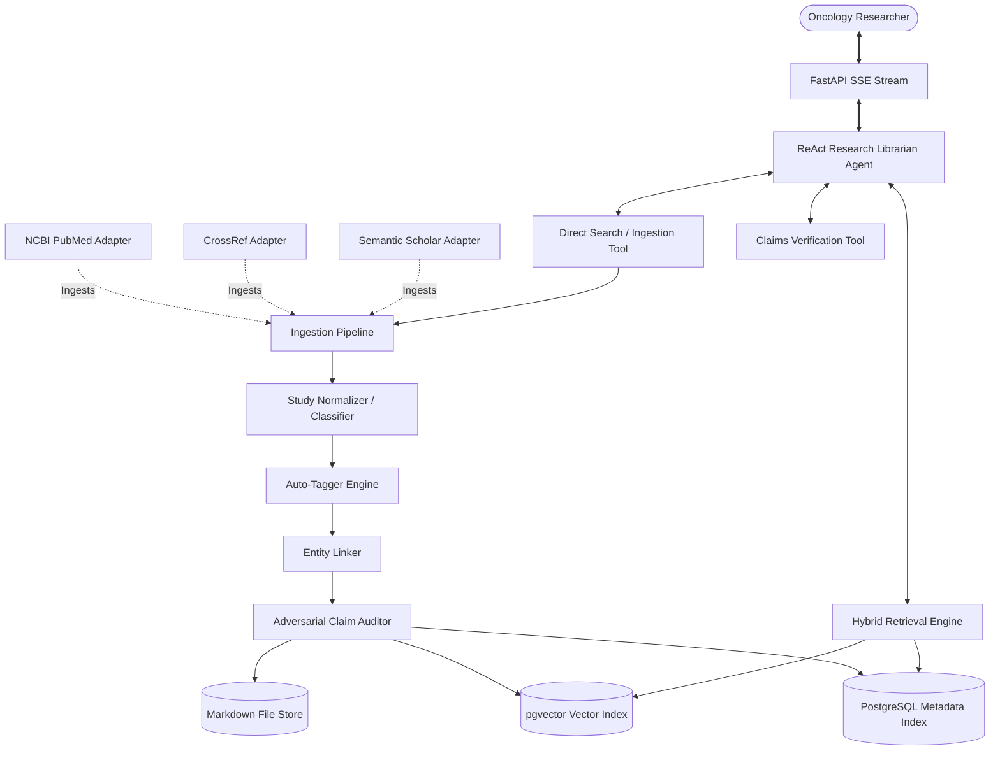

# <p align="center"><br>MEDICA</p>
<p align="center">
  <strong>Autonomous Oncology Intelligence Operating System</strong>
</p>

<p align="center">
  
  
  
  
  
  
</p>

---

**MEDICA** is a production-grade, agentic oncology research operating system. It continuously ingests, verifies, indexes, links, and maintains clinical and scientific cancer research knowledge from trusted, canonical databases (NCBI PubMed, CrossRef, and Semantic Scholar).

Going far beyond simple RAG or shallow chatbots, MEDICA acts as a **structured scientific memory system** and a **guarded oncology librarian** equipped with adversarial claim verification, clinical evidence grading, and real-time interactive citation graph cross-linking.

---

## 🚀 Core Architectural Engine

MEDICA comprises a pipeline of autonomous agentic systems designed to ingest, process, verify, and retrieve structured clinical information.



### 1. Ingestion Pipeline & Normalizer
* **Continuous Ingestion Pipeline**: Automatically ingests clinical trial papers, publications, and meta-analyses matching key oncology terms.
* **Study Type Normalizer**: Classifies incoming literature by evidence grade (e.g., Randomized Controlled Trials (RCTs), Meta-Analyses, Systematic Reviews, Preclinical Studies, Retrospective Cohorts).
* **Clinical Tagger**: Automatically extracts and catalogues entities across:
  * **22+ Cancer Types** (e.g., Lung Cancer, Breast Cancer, Glioblastoma, Leukemia, Melanoma, Pancreatic, Prostate, Colorectal).
  * **25+ Oncological Drugs** (e.g., Osimertinib, Pembrolizumab, Trastuzumab, Erlotinib, Cetuximab).
  * **20+ Biomarkers & Mutations** (e.g., EGFR, ALK, KRAS, BRAF, HER2, BRCA1/2, Mismatch Repair).

### 2. Adversarial Claim Verification Agent
* Uses a dual **LLM skeptic** and a **rule-based scorer** to audit clinical claims.
* Extracts asserted claims, cross-references sample sizes ($n$), identifies potential biases (e.g., preclinical models mislabeled as clinical evidence), validates $p$-values, and assigns an evidence level score before accepting papers into canonical storage.

### 3. Markdown-First Canonical Memory Store
* Stored transparently under `knowledge/cancers/<type>/papers/` as YAML-frontmatter structured markdown documents.
* Standardized, auditable format ensures clinical databases can be version-controlled, edited, and backed up easily.

### 4. Hybrid Retrieval & Reranker Engine
* Features a high-precision multi-stage retriever:
  * **pgvector Semantic Search (60%)** using advanced embeddings.
  * **PostgreSQL Full-Text Search (30%)** targeting exact clinical vocabulary.
  * **Categorical Tag Match (10%)** targeting explicit drug/biomarker markers.
* Employs a **Clinical Evidence Level Reranker** to weight high-quality human randomized trials over animal or preclinical data.

### 5. Autonomous ReAct Agent Loop
* Powered by a reasoning loop that executes tools to search, read, retrieve, and cross-reference research.
* Streams thoughts, tool calls, and observations live to the frontend using **Server-Sent Events (SSE)**.

---

## 🎨 Premium Frontend Portal

The client console is built using **Next.js (App Router), TypeScript, and Vanilla CSS**, engineered to deliver a premium, dark-mode terminal layout:

* 💬 **Chat Copilot**: Includes an interactive console that streams the ReAct reasoning chain (`Thought -> Action -> Observation`) through sleek collapsible panels.
* 🕸️ **Interactive Force Graph**: An interactive, physics-based canvas force-directed network mapping cancer classifications, drugs, and genetic biomarkers.
* 📂 **Knowledge File Explorer**: An in-browser markdown file manager allowing researchers to browse the clinical database schema directly.
* 📄 **Split-Screen Paper Viewer**: A split panel presenting clinical abstracts, evidence tags, adversarial critiques, and side-by-side links to contradictory or supportive trials.
* 📈 **Evidence Auditor**: A clean dashboard detailing identified clinical caveats (e.g., small sample sizes, source funding conflict).
* ⚙️ **Operator Console**: Allows administrators to trigger manual PubMed scrapes and monitor real-time background task schedules.

---

## 📁 Repository Structure

```
MEDICA/
├── backend/                  # Python FastAPI Backend Services
│   ├── agents/               # ReAct Research Librarian & Agent Tools
│   ├── api/                  # FastAPI App, SSE Streams, Admin, Search Router
│   ├── core/                 # App Settings, Core Event Loop, Logging Utilities
│   ├── indexing/             # Hybrid Keyword, Vector, & Metadata Indexers
│   ├── ingestion/            # PubMed, CrossRef, and Semantic Scholar Pipeline
│   ├── knowledge/            # Database Seeders, Canonical Markdown Store
│   ├── processing/           # Entity Linker, Study Normalizer, Auto-Tagger
│   ├── retrieval/            # Hybrid Retrieval Engine & Evidence Level Reranker
│   ├── scheduler/            # Background Ingestion & Verification Jobs
│   ├── shared/               # PostgreSQL Database Schemas, Models & Utils
│   ├── verification/         # Adversarial Claim Auditor & Skeptic Evaluators
│   └── requirements.txt      # Python Dependencies
│
├── frontend/                 # Next.js React Frontend Portal
│   ├── app/                  # Next.js App Router (Chat, Explorer, Graph, Admin)
│   ├── components/           # Force-directed graphs, copilot, split-panel viewer
│   └── package.json          # Node Dependencies
│
├── knowledge/                # Canonical Local Markdown Memory Store (Empty Skeletons)
│   ├── cancers/              # Cancers Directory structure
│   └── entities/             # Biomarkers, Drugs, and Genes Directory structures
│
├── scripts/                  # Convenience Database scaffolding SQL
│   └── init_db.sql           # Database Initialization Scaffolding
│
├── tests/                    # Backend Unit Tests
│
├── Makefile                  # Developer Convenience Shortcuts
├── .env.example              # Template Environment Variables
└── README.md                 # Project Documentation
```

---

## 🛠️ Step-by-Step Developer Setup

### 1. Prerequisites
Ensure you have the following installed on your machine:
* **Docker & Docker Compose**
* **Node.js (v18+)**
* **Python (3.10+)**

---

### 2. Configure Environment Variables
Copy `.env.example` to `.env` in the root workspace directory and configure your keys:
```bash
cp .env.example .env
```

Key Settings:
* `LLM_PROVIDER`: Set to `gemini` (default), `openai`, or `anthropic`.
* `GEMINI_API_KEY`, `OPENAI_API_KEY`, or `ANTHROPIC_API_KEY`: Provide your API key to activate the ReAct agent's thoughts and adversarial evaluations.
* **Note**: *If no API key is provided, the platform gracefully degrades to zero-API-key fallback mode using local direct hybrid index searches!*

---

### 3. Spin Up Using Docker Compose
Start PostgreSQL with `pgvector`, the FastAPI backend, and Next.js frontend with a single command:
```bash
docker-compose up --build -d
```

This spins up the complete microservices stack:
* **PostgreSQL + pgvector**: `localhost:5432` (Auto-scaffolds database tables!)
* **FastAPI Backend Application**: `localhost:8000` (FastAPI Swagger Docs available at `/docs`)
* **Next.js Frontend Client Portal**: `localhost:3000`

---

### 4. Running Locally Outside Docker (Development Mode)

If you prefer to run services individually for active development:

#### A. PostgreSQL Scaffolding
Ensure a PostgreSQL database is running on `localhost:5432`. Create a database named `medica` and run the script:
```bash
psql -h localhost -U postgres -d medica -f scripts/init_db.sql
```

#### B. Start Backend Service
```bash
cd backend
python -m venv venv
source venv/bin/activate  # On Windows: .\venv\Scripts\activate
pip install -r requirements.txt
uvicorn api.main:app --reload --port 8000
```

#### C. Start Frontend Client Portal
```bash
cd frontend
npm install
npm run dev
```

The app will run at `http://localhost:3000`.

---

## 📈 Dev Convenience Commands (Makefile)

A clean `Makefile` is located in the root directory to simplify operations:
* `make up` - Start all container services.
* `make down` - Shut down all container services.
* `make backend-logs` - Stream FastAPI backend console logs.
* `make db-shell` - Enter PostgreSQL client terminal.
* `make test` - Run backend python unit tests.

---

## 🔬 Operational Seed Queries

To seed the knowledge base and populate all dashboards with high-quality clinical data immediately, navigate to the **System Operator** (`/admin`) page or trigger the seeder from the console, or simply ask the **Chat Copilot**:

* 🧪 *"Verify osimertinib combination trials in EGFR NSCLC"*
* 🧪 *"Review pembrolizumab in mismatch repair-deficient colorectal cancer"*
* 🧪 *"What clinical evidence supports CAR-T infusion in glioblastoma?"*
