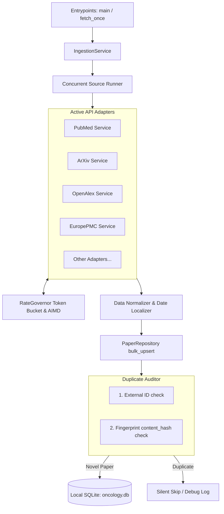

# MEDICA: Oncology Ingestion Agent Operator's Manual

This document provides exact running instructions for the integrated **Oncology Ingestion Agent** services, followed by an architectural deep-dive documenting how each core component operates.

---

## 🚀 Execution Guide

Always execute commands from within the `MEDICA/` directory:
```bash
cd MEDICA
```

### 1. Continuous Ingestion Service (Daemon)
This starts the long-running continuous crawler. It periodically wakes up to harvest oncology literature across 20+ cancer buzzwords, paces itself dynamically, and sleeps between cycles.

* **Command**:
  ```bash
  PYTHONPATH=. uv run python -m ingestion_agent.app.main
  ```
* **Polling Interval**: Configured by `POLLING_INTERVAL` in `.env` (default: 300 seconds / 5 minutes).

---

### 2. Single-Run Manual Synchronizer
Runs a single, comprehensive discovery cycle across all 11+ active research sources concurrently. The service will fetch up to 10 latest articles per keyword for all keywords, upsert new entries into the local database, and exit.

* **Command**:
  ```bash
  PYTHONPATH=. uv run python -m ingestion_agent.scripts.fetch_once
  ```

---

### 3. Database Reset Utility
A quick maintenance script that safely deletes the SQLite `oncology.db` database file to let you perform a fresh synchronization.

* **Command**:
  ```bash
  PYTHONPATH=. uv run python -m ingestion_agent.scripts.clean_reset
  ```

---

### 4. Interactive Harvester Tester
A diagnostic console tool that bypasses the database and tests connections to all active API sources directly, printing out raw metadata returns and latency results.

* **Command**:
  ```bash
  PYTHONPATH=. uv run python -m ingestion_agent.scripts.test_harvester
  ```

---

## 🏗️ Component Architecture & How it Works

The ingestion agent uses a modular, robust concurrency architecture designed for high throughput, strict API rate-limit compliance, and bulletproof duplicate-filtering.



### 1. Configuration (`app/config/settings.py`)
* **How it works**: Uses `pydantic-settings` to load and validate environment configurations at startup.
* **Responsibilities**: Manages SQLite connection string (`DATABASE_URL`), API Keys (`NCBI_API_KEY`, `SEMANTIC_SCHOLAR_API_KEY`), `POLLING_INTERVAL`, and application verbosity (`LOG_LEVEL`).

### 2. Database Engine (`app/db/session.py`, `app/models/`)
* **How it works**: Uses SQLAlchemy 2.0's AsyncIO extensions combined with `aiosqlite`.
* **Database Lifecyle**: Automatically initializes the SQLite database tables on startup (`init_db()` is called inside the service entrypoints if the schema is not present).
* **Models**:
  * `Paper`: Represents normal clinical literature including titles, abstracts, DOIs, URLs, and custom oncology evidence scores.
  * `SyncState`: Tracks the timestamp of the last successful query for each source-keyword combination.

### 3. Smart Rate Limiter (`app/utils/rate_limiter.py`)
* **How it works**: An advanced, thread-safe AsyncIO Token Bucket rate governor.
* **Dynamic Pacing (AIMD)**: If a service hits a transient `429 Too Many Requests` or `503 Service Unavailable` error, the governor executes an Additive-Increase/Multiplicative-Decrease (AIMD) algorithm:
  1. It **halves the refill rate** (doubles the delay time) for that specific API on the fly.
  2. It dynamically increases request capacity once successful requests begin reporting back.
* **Circuit Breakers**: Tracks consecutive network failures. If an API service fails 2 times consecutively, the circuit breaker trips to `OPEN`, completely blocking requests to that source for 5 minutes so it doesn't get your server blacklisted.

### 4. Concurrent Harvester Service (`app/services/`)
* **How it works**: Organizes calls by executing all API sources concurrently via `asyncio.gather`. 
* **Dynamic Search Coroutines**: Runs a looping structure across all `BUZZWORDS`. Each service requests papers sequentially but runs in parallel with other services.
* **Source Resilience**: If one source hits a network timeout or temporary block, it gracefully skips that keyword and adapts its speed, allowing the remaining 10+ sources to proceed without delay.

### 5. Repository & Duplicate Filter (`app/repositories/paper_repository.py`)
* **How it works**: The data access layer performing a dual-stage deduplication:
  1. **Source-Specific ID Check**: Checks if a paper with the exact same `source` and `external_id` already exists.
  2. **Content Hash Check**: Generates a SHA-256 fingerprint hash based on the paper's title and abstract. If the same content is found (even under a different database source), it is detected as a duplicate.
* **Silent Skipping**: Duplicate papers are skipped silently (only logged under `DEBUG`), which keeps your standard stdout telemetry clean, concise, and focused on new discoveries.
